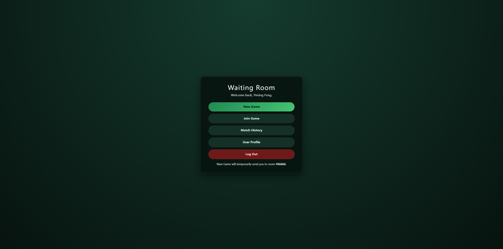
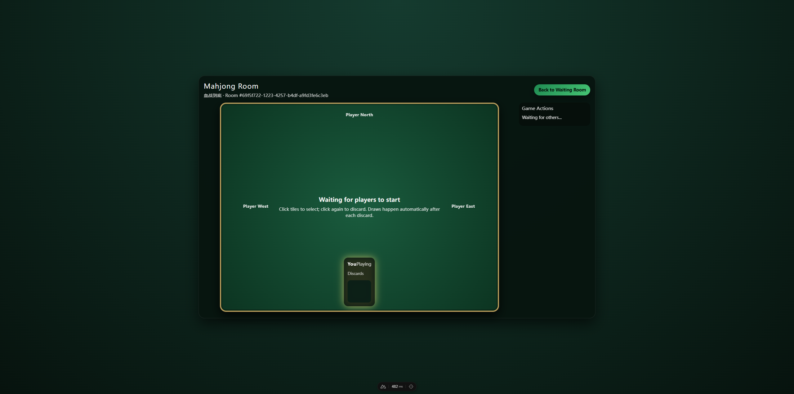
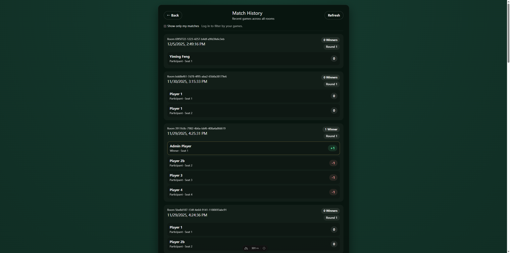

# Blood on Mahjong

A real-time multiplayer Sichuan Mahjong (血战到底) web application with WebSocket-based gameplay, Google OAuth authentication, and Kubernetes deployment.

---

## Demo





---

## Features

- **Real-Time Multiplayer** — WebSocket (Socket.IO) with Redis adapter for horizontal scaling across multiple server instances
- **Sichuan Mahjong Rules** — Full implementation of 血战到底 (Blood Fight) variant including Kong scoring, missing-suit declaration, and multi-winner support
- **Authentication** — Google OAuth 2.0 with session management; mock login for development/testing
- **Game State Persistence** — MongoDB-backed game state with automatic hydration on server restart
- **Match History** — Persistent game records with player scores, win/loss tracking, and round details
- **Room Management** — Create, join, and spectate game rooms with real-time player count updates
- **Automated Testing** — Playwright E2E tests integrated into CI/CD pipeline
- **Container-Native Deployment** — Docker multi-stage builds, Helm charts, and Kubernetes manifests via Werf

---

## Tech Stack

| Layer | Technologies |
|-------|--------------|
| **Frontend** | Vue 3, Nuxt 4, Nuxt UI, TypeScript |
| **Backend** | Nuxt Server (Nitro), Socket.IO, Node.js |
| **Database** | MongoDB Atlas |
| **Cache / Pub-Sub** | Redis (Socket.IO adapter) |
| **Auth** | Google OAuth 2.0, Session cookies |
| **Infrastructure** | Docker, Kubernetes, Helm, Werf |
| **CI/CD** | GitHub Actions, Playwright |

---

## Installation

### Prerequisites

- Node.js 20+
- MongoDB instance (local or Atlas)
- Redis (optional, for multi-instance scaling)

### Setup

```bash
# Clone the repository
git clone https://github.com/Justin6Liu/blood-on-mahjong.git
cd blood-on-mahjong

# Install dependencies
npm install
```

Create `.env` with your credentials:

```env
MONGODB_URI=mongodb://localhost:27017
MONGODB_DB=blood_on_mahjong
REDIS_URL=redis://localhost:6379
GOOGLE_CLIENT_ID=your-client-id
GOOGLE_CLIENT_SECRET=your-client-secret
GOOGLE_REDIRECT_URI=http://localhost:3000/api/auth/google/callback
```

---

## Usage

### Development

```bash
npm run dev
```

Open [http://localhost:3000](http://localhost:3000).

### Production Build

```bash
npm run build
npm run start
```

### Run Tests

```bash
# E2E tests with Playwright
npm test

# With custom base URL
BASE_URL=http://localhost:3000 npm test
```

---

## Project Structure

```
blood-on-mahjong/
├── app/                    # Frontend (Nuxt)
│   ├── components/         # Vue components (MahjongTile, PlayerArea, etc.)
│   ├── composables/        # Composition API hooks (useGame)
│   ├── pages/              # Route pages (login, gameroom, history)
│   └── middleware/         # Auth guards
├── server/                 # Backend (Nitro)
│   ├── api/                # REST endpoints (auth, game, rooms, history)
│   ├── services/           # Business logic (AuthService, GameService)
│   ├── utils/              # Core utilities (gameManager, socket, tiles)
│   └── types/              # TypeScript definitions
├── tests/                  # Playwright E2E tests
├── .github/workflows/      # CI/CD pipeline
├── .helm/                  # Kubernetes Helm charts
├── Dockerfile              # Multi-stage container build
└── werf.yaml               # Werf deployment config
```

---

## License

MIT
